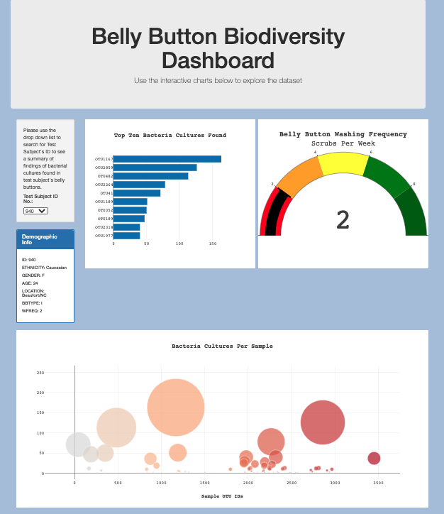

# Belly Button Bacteria Analysis

We have created a data visualization of the result of a study to determine if subjects have a specific type of bacteria around their belly button to be used as a key ingredient for imitation beef.

* The horizonal bar chart display the top 10 bacterial species (OTUs) when an individual’s ID is selected from the dropdown menu on the web page. 

* The gauge chart display to the right of the horizonal bar chart shows the weekly belly button scrubbing frequency. This is range between 0-10.

* The bubble chart is displayed toward the bottom of the page. The bubble’s size correlates to the amount of the type of bacteria found in the sample.

## Software 
JavaScript, Plotly, and CSS

Webpage: https://pimchanyachitsanga.github.io/plotlydiploy/

